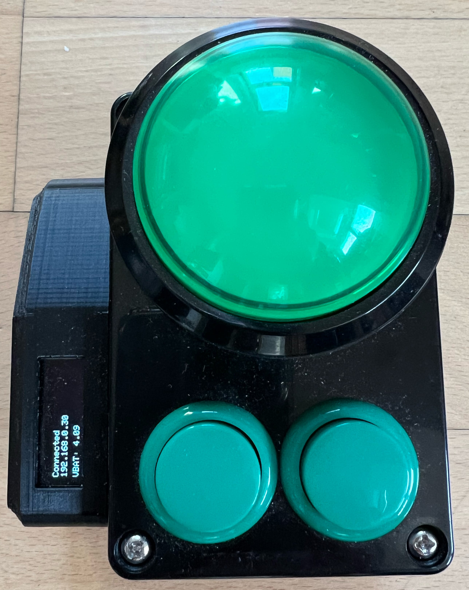

# MagicBuzzer
It's a quiz buzzer. It's wireless. It's magic! 

## Installation
### Buzzer Firmware
Just flash the `MagicBuzzer.ino` Arduino Firmware to the custom ESP8266 buzzer hardware.

### Server
The backend server is based on a Python [Flask](https://flask.palletsprojects.com/en/2.2.x/) server.

- `cd MagicBuzzer/python`
- Install dependencies: `python3 -m pip install -r requirements`
- Run the server: `python3 main.py`

It makes sense to run the server on a Raspberry with WiFi hardware and host a WiFi hotspot from there.

## Usage
1. Power the Raspberry and wait for the WiFi to become visible (ca. 1min)
2. Connect to WiFi.
    - SSID: `BuzzerWifi`
    - Password: `BuzzerWifi`
3. Open page in browser: http://192.168.0.1:5001/
4. Turn on the buzzers -> display should show `Connected` and valid IP address 

    

5. Webpage will refresh itself and buzzers can be used now

